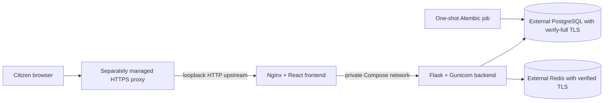

# SCMIRN deployment architecture

**Current release verdict: NOT PRODUCTION READY.** The 2026-10-03 candidate gate passed backend, governance parity, frontend typecheck/build/browser, feature parity, and OpenAPI route checks. It still exits 1 because 12 engineering controls remain open and no authorized production configuration was supplied. Production triage/jurisdiction resolution remains disabled. Identity and legacy tenant isolation, backup/restore, rollback, exact-release security scans, accessibility, production monitoring, and external approvals remain open. The earlier Compose rehearsal is local deployment evidence, not a production deployment or government approval.

## Development stack

`infrastructure/docker-compose.yml` is the existing development stack. It reads the development environment, uses SQLite, enables local demo behavior, and is not a production topology. Do not use its `.env` file for production.

## Production Compose topology



`infrastructure/docker-compose.production.yml` builds release-tagged frontend and backend images. Only Nginx is published, bound to `127.0.0.1`; the backend is private to the Compose network. PostgreSQL and Redis are external services and are not provisioned by this Compose file. HTTPS termination, DNS, WAF, secret management, backups and monitoring must be provided separately.

The one-shot `migrate` service runs Alembic and must complete before the backend starts. Backend readiness checks PostgreSQL and Redis. The 2026-10-03 OpenAPI/production-gate check covered 15 allowlisted route patterns and verified that 99 other registered API operations return 503. Triage/jurisdiction resolution, legacy reporting, file, document, office, tracking, analytics and simulation APIs stay disabled. The catalog currently exposes four internally reviewed, `OFFICIAL_HANDOFF_ONLY` service candidates; a fifth remains withheld. Handoffs return `NOT_SUBMITTED`, and SCMIRN has no government filing or status connector.

## Production inputs and release identity

Copy `.env.production.example` to a protected `.env.production`, then set:

- Distinct random `SCMIRN_SECRET_KEY` and `SCMIRN_JWT_SECRET_KEY` values.
- An immutable `SCMIRN_RELEASE_ID` for the exact build; `latest` and placeholder tags are rejected.
- External PostgreSQL and Redis URLs with mounted CA files. PostgreSQL requires `sslmode=verify-full`; Redis requires `ssl_cert_reqs=required` and `ssl_check_hostname=true`.
- Existing absolute CA file paths, explicit HTTPS CORS origins, and a loopback HTTP port for the separately managed HTTPS proxy.

`scripts/validate_production_config.py` checks this policy without printing secret values. `scripts/deploy.sh validate` also checks the Compose model but does not contact either data service.

## Commands

```sh
cp .env.production.example .env.production
# Replace all placeholder values and configure the mounted CA files.
SCMIRN_ENV_FILE=.env.production scripts/deploy.sh validate
SCMIRN_ENV_FILE=.env.production scripts/deploy.sh build
SCMIRN_ENV_FILE=.env.production scripts/deploy.sh deploy
SCMIRN_ENV_FILE=.env.production scripts/deploy.sh rollback
SCMIRN_ENV_FILE=.env.production scripts/deploy.sh status
SCMIRN_ENV_FILE=.env.production scripts/deploy.sh logs
SCMIRN_ENV_FILE=.env.production scripts/deploy.sh stop
```

`build` and `deploy` refuse to reuse a backend or frontend release tag already present in the local Docker image store. `deploy` builds release-tagged images, runs migrations, waits for health checks, and smoke-checks the frontend root, `/documents`, proxied API readiness, and the disabled legacy API boundary. `rollback` starts already-retained local images for the `SCMIRN_RELEASE_ID` in the environment file; it refuses to build or pull missing images and does not restart the migration service. `stop` does not delete database data or Docker volumes. Use the environment's approved operator procedure before touching a live environment.

## Verified local rehearsal

On 2026-10-01, a disposable local Compose environment completed PostgreSQL and Redis TLS probes, PostgreSQL Alembic upgrade, backend and frontend health checks, root and nested-route smoke, proxied readiness, disabled legacy API check, audit-update rejection, and synthetic triage abstention. The route result was `NOT_SUBMITTED`; no external action occurred. The disposable services and certificates were removed afterward.

This proves the tested local deployment slice only. It does not test an existing production dataset, a full legacy schema migration, RLS/tenant separation, backup/restore, the external proxy, DNS, monitoring, production credentials, or rollback to a prior image. See [`RELEASE_EVIDENCE.json`](release/RELEASE_EVIDENCE.json) and [`TEST_EVIDENCE_MATRIX.md`](merge/TEST_EVIDENCE_MATRIX.md).

## Rollback boundary

Release IDs distinguish built images, so an operator can select a retained prior image tag. `scripts/deploy.sh rollback` is implemented, but no rollback rehearsal has passed. Before deployment, record the previous release ID, confirm migration compatibility and image retention, set that prior ID, run the rollback command, and validate readiness plus representative reads. Do not run a schema downgrade as an application rollback unless that migration has an explicitly reviewed reversible path.

## Operational gaps

- No production identity provider or deployed tenant policy is verified. Forced RLS for staff and evidence metadata passed the disposable PostgreSQL 16 test, but its transaction-local tenant GUC is application-set and is not an independent tenant credential.
- The routing migration is not the full schema baseline for legacy model tables.
- The retention purge is an operator CLI command; this Compose file has no scheduler or lag alert.
- No production metrics, tracing, actionable alert routing, backup service, DR site, or approved evidence object store/scanner is configured. Evidence routes remain disabled.
- The TLS reverse proxy, WAF, public DNS, and host/network boundary controls are external to this repository.
- Government connectors, file upload, payment/funding, and official document submission are disabled or unimplemented.

See the [`runbooks`](runbooks/README.md), [`government readiness matrix`](merge/GOVERNMENT_READINESS_MATRIX.md), and [`security gap matrix`](merge/SECURITY_GAP_MATRIX.md) before any pilot decision.
