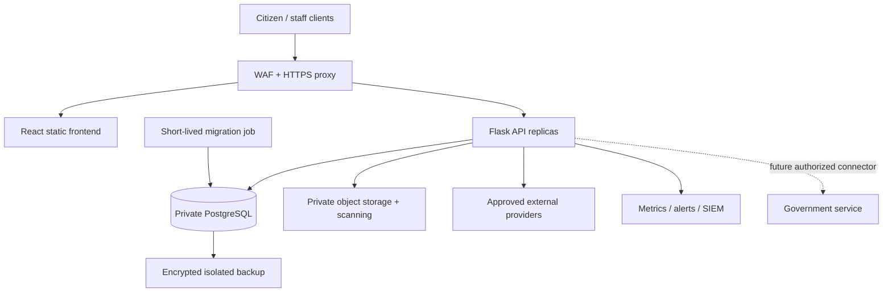

# Deployment topology (target draft)

Current canonical deployment is not established by this diagram. The local baseline uses SQLite and Vite dev/test commands; the ZIP Compose stack was not run. Supply actual cluster/container inventory, deployment YAML, network controls, storage/region, backup and recovery evidence for STQC review.
