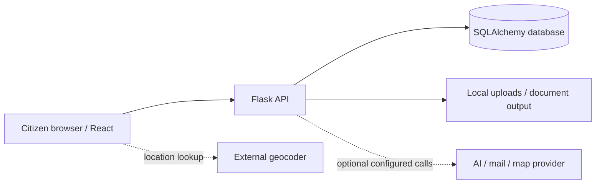

# System architecture (STQC evidence draft)

## Reviewed local implementation

- Public frontend: React + TypeScript + Vite under `src/frontend`; React Router routes to home, offices, heatmap, tracker, analytics, documents and platform workspaces.
- API: Flask app factory under `src/backend/app`; route families are registered in `app/__init__.py` and `app/api/v1/**`.
- Persistence: SQLAlchemy models in `app/infrastructure/database/models.py`; local SQLite default; current bootstrap calls `db.create_all()`.
- External boundaries: browser geocoder, optional AI/email/maps configuration and local upload/download paths. Current production use and data region are not verified.
- Source archive has a separate Flask/SQLAlchemy/PostgreSQL candidate application. It is a feature source, not part of canonical runtime.

## Data path

This is an architectural summary from code, not an audited deployment diagram. Production topology, identity boundary and external provider contracts require validation.
