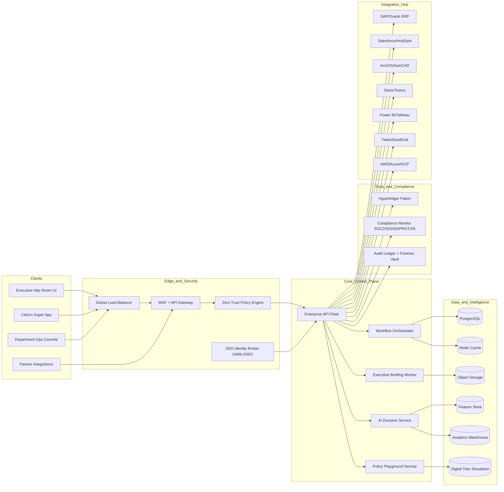

# SCMIRN Illustrative Enterprise Target Architecture

> **Status (2026-10-01): target-state proposal, not the deployed system.** The diagram below describes a possible future architecture; WAF/API gateway, SSO broker, workflow workers, feature store, analytics warehouse, Hyperledger, SOC controls, and listed third-party connectors are not established by repository evidence. Do not use this document to claim a government deployment or enterprise production readiness.

## Current implementation boundary

- Canonical web client: React/Vite in `src/frontend`.
- Canonical API: Flask in `src/backend`; the new source-gated triage API is under `/api/v1`.
- Development persistence: SQLite. Production configuration requires PostgreSQL via Psycopg 3 and TLS Redis, but no PostgreSQL deployment or production startup has been tested.
- The route catalog is empty because the candidate official source is unavailable and has no content hash. Triage abstains and never submits a filing.
- Existing enterprise and simulation APIs are blocked by the production readiness gate. Their UI workspaces are demos, not connectors or operational controls.
- The routing/audit migration creates only the seven route-schema tables. It is not a baseline migration for every legacy model.

The engineering boundaries and evidence are tracked in [`../merge/GOVERNMENT_READINESS_MATRIX.md`](../merge/GOVERNMENT_READINESS_MATRIX.md) and [`../merge/TEST_EVIDENCE_MATRIX.md`](../merge/TEST_EVIDENCE_MATRIX.md).

## Scope
This architecture extends SCMIRN into an enterprise deployment model for large governments and Fortune 500 city operators.

## Microservices & Data Flow

## Security Layers
1. Identity: SSO with SAML/OIDC + adaptive MFA.
2. Access: Zero-trust policy checks on every API request.
3. Workload: Signed images, runtime posture checks, namespace isolation.
4. Data: Encryption at rest, envelope encryption, audit chains on Hyperledger.
5. Incident response: Automated kill switch to isolate compromised nodes while preserving critical services.

## Reliability Strategy
1. Multi-region active-active with traffic failover.
2. SLO target: 99.999% control-plane uptime.
3. Autoscaling for 10x emergency spikes.
4. Chaos drills for service, database, and network fault injection.

## Enterprise KPIs
1. Real-time city health score (0-100).
2. Forecast risk coverage (7/30/90 days).
3. Crisis response time and resolution SLA attainment.
4. Prevented-loss ROI and payback period.
