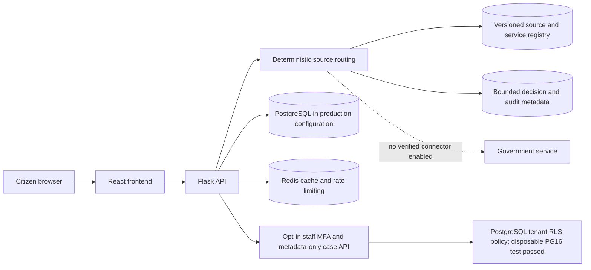

# SCMIRN reference architecture

## Implemented repository architecture

SCMIRN is currently a modular monolith: a React/TypeScript/Vite frontend and Flask application with SQLAlchemy, Alembic, PostgreSQL production configuration, Redis-backed cache/rate-limit configuration, and deterministic `source_routing`. Alembic head `20261002_04` covers all 34 ORM tables. Staff password+TOTP, tenant roles and a metadata-only case API are implemented; the full migration chain, four database roles and staff RLS passed disposable PostgreSQL 16 tests. Production database/runtime-role validation remains open. No durable worker contract, production object store, government connector runtime, staff UI or production identity provider is verified.

## Safe routing boundary

The route path requires explicit consent, applies versioned phrase rules, checks active effective dates and verified source hashes, checks exact source-host alignment for handoff URLs, requires matching configured geography for local services, and stores bounded derived facts. Raw triage descriptions are not stored by this path; tests verify that property. Five official handoff candidates are imported; four currently pass verification and host checks. The cybercrime portal candidate stays hidden while its certificate fails TLS validation. All routes remain `OFFICIAL_HANDOFF_ONLY`; `NOT_SUBMITTED` and null official reference remain explicit.

## Target deployment (not deployed)

An agency-approved deployment must validate PostgreSQL RLS with its configured non-owner runtime role, add tenant ownership for legacy records, and may require an identity provider, private scanned object storage, durable workflow worker, egress-restricted connectors, and SIEM/metrics/tracing. The local PostgreSQL test is not deployment evidence. Each component requires an accountable operator and tested controls before use. See [`DEPLOYMENT_MODEL.md`](DEPLOYMENT_MODEL.md), [ADRs](../architecture/adr/README.md), and [deployment architecture](../DEPLOYMENT_ARCHITECTURE.md).
